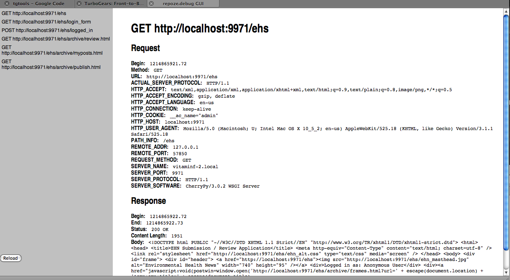

Using the :mod:`repoze.debug` Response Logger
=============================================

The :mod:`repoze.debug` response logger allows the developer to record
information about each request / response pair, and to analyze that
information to identify parts of the application which are performing badly.

This support comes as two separate components:

- The :ref:`responselogger_middleware` performs the actual logging of
  request / response data.

- The :ref:`wsgirequestprofiler` console script generates various reports
  using those logs.

.. _responselogger_middleware:

responselogger Middleware
#########################

The responslogger middleware creates two logs: the :ref:`verbose_log` and
the :ref:`trace_log`.

The verbose log is human-readable.

The trace log is meant to be processed by the :ref:`wsgirequestprofiler`
(included).

Configuration via Python
------------------------

To wire up the middleware in your application in imperative Python code:

.. code-block:: python

 from repoze.debug.responselogger import ResponseLoggingMiddleware
 from logging import getLogger
 middleware = ResponseLoggingMiddleware(
                app,
                max_bodylen=3072,
                keep=100,
                verbose_logger=getLogger('foo'),
                trace_logger=getLogger('bar'),
               )

The configuration options are as follows:

 - ``max_bodylen`` should be the max size in bytes of the response
   body that should be logged.

 - ``keep`` is the number of request entries to keep around in memory
   to service the :ref:`debug_ui`.

 - ``verbose_logger`` is a PEP 282 logger instance (any).

 - ``trace_logger`` is a PEP 282 logger instance (any).

Configuration via Paste
-----------------------

Wire the middleware into a pipeline in your Paste configuration, for
example:

.. code-block:: ini

 [filter:responselogger]
 use = egg:repoze.debug#responselogger
 verbose_log = %(here)s/response.log
 trace_log = %(here)s/trace.log
 # if max_bodylen is unset or is 0, it means do not limit body logging
 # default is 3KB
 max_bodylen = 3KB
 # if max_logsize is unset or is 0, it means do not limit logsize; default is
 # 100MB
 max_logsize = 100MB
 # if backup_count is 0, do not rotate the logfile.  Default is 10.
 backup_count = 10
 # "keep" is the the number of entries to keep around to show in the
 # GUI. If keep is 0, no entries are kept (keeping entries around
 # to show in the UI may be a security issue, as access to the GUI
 # isn't authenticated)
 keep = 100
 ...

 [pipeline:main]
 pipeline = egg:Paste#cgitb
            responselogger
            myapp

The middleware will log verbose response data to ``response.log`` and
will log trace data to ``trace.log``.

Viewing Request / Response Data
###############################

.. _verbose_log:

Verbose logger
--------------

Once the middleware is in the pipeline, it will log human-readable
information about requests and responses to the verbose logger.  For
example, the logged information for a request might be::

  --- begin REQUEST for 5930704 at Mon Jun 30 13:37:51 2008 ---
  URL: GET http://127.0.0.1:9971/favicon.ico
  CGI Variables
    ACTUAL_SERVER_PROTOCOL: HTTP/1.1
    HTTP_ACCEPT: */*
    HTTP_HOST: 127.0.0.1:9971
    HTTP_USER_AGENT: ApacheBench/2.0.40-dev
    PATH_INFO: /favicon.ico
    REMOTE_ADDR: 127.0.0.1
    REMOTE_PORT: 56527
    REQUEST_METHOD: GET
    SERVER_NAME: vitaminf-2.local
    SERVER_PORT: 9971
    SERVER_PROTOCOL: HTTP/1.0
    SERVER_SOFTWARE: CherryPy/3.0.2 WSGI Server
  WSGI Variables
    application: <paste.httpexceptions.HTTPExceptionHandler object at 0x17c4b10>
    wsgi process: Multithreaded
  --- end REQUEST for 5930704 ---

Each request is tagged with a (random) identifier.  A response is also
written to the verbose log, and can be matched up to the request that
generated it via the identifier.  If ``max_bodylen`` is specified and
is nonzero, only the leading bytes of the body up to ``max_bodylen``
are logged, otherwise the entire body is logged.  Here's an example of
a response in the log::

  --- begin RESPONSE for 5930704 at Mon Jun 30 13:37:51 2008 ---
  URL: GET http://127.0.0.1:9971/favicon.ico
  Status: 200 OK
  Response Headers
    Accept-Ranges: bytes
    Content-Length: 112
    Content-Type: application/octet-stream
    Last-Modified: Thu, 29 May 2008 23:47:57 GMT
  Body:
  ^@^@^A^@^F^@^P^P^@^@^A^@ ^@h^D^@^@f^@^@^@^P^P^@^@^A^@^H^@h^E^@^@<CE>^D^@^@
  ^@^@^A^@ ^@<A8>^P^@^@6
  Bodylen: 112
  --- end RESPONSE for 5930704 (0.03 seconds) ---

.. _debug_ui:

Debug UI
--------

If your application pipline includes the :mod:`repoze.debug` responselogger
middleware, you can vist the path ``/__repoze.debug/static/debugui.html`` in
your browser to see a paned debug interface:

This page shows recent requests and responses, up to as many
request/response pairs are kept around as specified by the  ``keep`` 
value in the middleware configuration.

Analyzing the Log Data
######################

.. _trace_log:

Trace logger
------------

The trace logger logs detailed debugging information about WSGI
requests and responses.  This logging can be turned on while the
server is in production.  It can then be postprocessed to help locate
troublesome application code.

The format of a log message is::

    {code} {pid} {request id} {time} {data}

Where::

    {code} is B for begin, A for received output from the application,
    E for finished sending output to the client.  A special code
    exists, U, that is not really tied to any particular request.  It
    is written to the log upon the first request after the server
    is started.

    {request id} is a unique request id.

    {time} is the local time as seconds past the epoch.

    {data} is the HTTP method and the URL for B, the HTTP status code
    and the value of the content-length header for A, the actual
    content length for E, and nothing for U.

For example::

  U 91978 5930704 1214847471.97
  B 91978 5930704 1214847471.97 GET http://127.0.0.1:9971/favicon.ico
  B 91978 17963168 1214847471.97 GET http://127.0.0.1:9971/favicon.ico
  A 91978 17963168 1214847471.99 200 112
  A 91978 5930704 1214847471.99 200 112
  E 91978 17963168 1214847471.99 112
  E 91978 5930704 1214847471.99 112
  B 91978 18022448 1214847472.0 GET http://127.0.0.1:9971/favicon.ico
  A 91978 18022448 1214847472.01 200 112
  B 91978 48634016 1214847472.01 GET http://127.0.0.1:9971/favicon.ico
  E 91978 18022448 1214847472.01 112
  B 91978 7805232 1214847472.01 GET http://127.0.0.1:9971/favicon.ico
  A 91978 48634016 1214847472.01 200 112
  E 91978 48634016 1214847472.01 112
  A 91978 7805232 1214847472.02 200 112
  E 91978 7805232 1214847472.02 112

This information is meant to be parsed with the included
``wsgirequestprofiler`` console script to help in debugging hangs or
requests that take "too long".  Run the ``wsgirequestprofiler`` script
with the --help flag for more information.

.. _wsgirequestprofiler:

wsgirequestprofiler script
--------------------------

Usage:

.. code-block:: sh

   $ bin/wsgirequestprofiler filename1 [filename2 ...]
          [--cumulative | --detailed | [--timed --resolution=seconds]]
          [--sort=spec]
          [--top=n]
          [--verbose]
          [--today | [--start=date] [--end=date] | --daysago=n ]
          [--writestats=filename | --readstats=filename]
          [--urlfocus=url]
          [--urlfocustime=seconds]
          [--help]

Provides a profile of one or more repoze.debug "trace" log files.
Note that this script is a port of the Zope2 ``requestprofiler``
script (written originally in 2001!)

Reports are of four types: ``cumulative``, ``detailed``, ``timed``, or
``urlfocus``.  By default, the script produces a ``cumulative`` report.
Data is taken from one or more :ref:`trace_log` files, or from a
preprocessed statistics file.

For ``cumulative`` reports, each line in the profile indicates information
about a URL collected via a detailed request log.

For ``detailed`` reports, each line in the profile indicates information about
a single request.

For ``timed`` reports, each line in the profile indicates information about
the number of requests and the number of requests/second for a period of time.

For ``urlfocus`` reports, the report contains ad-hoc information about
requests which precede or follow requests for specified URL.

Each ``filename`` is a path to a trace log that contains detailed
request data.  Multiple input files can be analyzed at the same time
by providing the path to each file.  Analyzing multiple trace log
files at once is useful if you have more than one machine running your
application and you'd like to get an overview of all logs on those
machines.

If you wish to make multiple analysis runs against the same input
data, you may want to use the ``--writestats option``.  The ``--writestats``
option creates a file which holds preprocessed data representing the
specfified input files.  Running subsequent reports (for example with
different sort specs) will be much faster using the ``--readstats`` option
with that saved file, rather than re-parsing the log files.

If a ``sort`` value is specified, sort the profile info by the spec.
The sort order is descending unless indicated.  The default cumulative
sort spec is ``total``.  The default detailed sort spec is ``start``.

``cumulative`` reports understand following sort specs:

``hits``
    the number of hits against the method
``hangs``
    the number of unfinished requests to the method
``max``
    the maximum time in secs taken by a request to this method
``min``
    the minimum time in secs taken by a request to this method
``mean``
    the mean time in secs taken by a request to this method
``median``
    the median time in secs taken by a request to this method
``total``
    the total time in secs across all requests to this method
``url``
    the URL/method name (ascending)

`detailed` (non-cumulative) reports understand the following sort specs:

``start``
    the start time of the request to repoze.debug (ascending)
``win``
    the num of secs repoze.debug spent waiting for input
``wout``
    the secs repoze.debug spent waiting for output from app
``wend``
    the secs repoze.debug spent sending data to server
``total``
    the secs taken for the request from begin to end
``endstage``
    the last successfully completed request stage (B, I, A, E)
``osize``
    the size in bytes of output provided by repoze.debug
``httpcode``
    the HTTP response code provided by the app (ascending)
``active``
    total num of requests pending at the end of this request
``url``
    the URL  (ascending)

`timed` and `urlfocus` reports do not allow any sort specs.

The ``top`` option restricts the report to the top ``n`` entries
in the profile (as per the sort). By default, each report shows all data in
the profile.

The ``verbose`` argument prevents the report from trimming URLs to fit
into 80 columns.

The ``today`` argument limit results to hits received today.

The ``daysago`` argument limits results to hits received since ``n`` days ago.

The ``resolution`` argument is used only for timed reports:  it specifies
the number of seconds between consecutive lines in the report.  The default
value is 60 seconds.

The ``urlfocustime`` argument is used only for urlfocus reports:  it
specifies the number of seconds to target before and after the URL
provided in urlfocus mode.  The default value is 10 seconds.

The ``start`` argument limits results to hits received after the specified
date/time, given in the form ``DD/MM/YYYY HH:MM:SS`` (local time)

The ``end`` argument limits results to hits received before the specified
date/time, given in the form 'DD/MM/YYYY HH:MM:SS' (local time),

The ``start`` and ``end`` arguments are not honored when request statistics
are obtained via the ``--readstats`` argument.

wsgirequestprofiler Examples
----------------------------

Show cumulative report statistics for information in the file 'debug.log',
by default sorted by 'total'::

  $ bin/wsgirequestprofiler debug.log

Show detailed report statistics sorted by 'start' (by default)::

  $ bin/wsgirequestprofiler debug.log --detailed

Show detailed report statistics for both logs sorted by 'start'
(by default)::

  $ bin/wsgirequestprofiler debug.log debug2.log --detailed

Show cumulative report statistics sorted by mean for entries in the log
which happened today;  do not trim the URL in the resulting report::

  $ bin/wsgirequestprofiler debug.log \
    --cumulative --sort=mean --today --verbose

Show cumulative report statistics, sorted by mean, for entries in the log
which happened three days ago;  do not trim the URL in the resulting report::

  $ bin/wsgirequestprofiler debug.log \
    --cumulative --sort=mean --daysago=3 --verbose

Show a ``urlfocus`` report which displays statistics about requests
surrounding the invocation of ``/manage_main``.  Focus on the time periods
60 seconds before and after each invocation of the ``/manage_main`` URL::

  $ bin/wsgirequestprofiler debug.log \
    --urlfocus='/manage_main' --urlfocustime=60

Show detailed report statistics for entries in ``debug.log`` which
begin after 6am local time on May 10, 2001 and which end before
11pm local time on May 11, 2001::

  $ bin/wsgirequestprofiler debug.log \
    --detailed --start='2001/05/10 06:00:00' --end='2001/05/11 23:00:00'

Show timed report statistics for entries in the log for one day,
using a resolution of 5 minutes::

  $ bin/wsgirequestprofiler debug.log \
    --timed --resolution=300 --start='2001/05/10 06:00:00'
    --end='2001/05/11 23:00:00'

Show cumulative report of the the ``top`` 100 methods sorted by maximum
elapsed time::

  $ bin/wsgirequestprofiler debug.log --top=100 --sort=max

Write a stats file for debug.log and debug2.log into ``requests.stat`` and
show the default report::

  $ bin/wsgirequestprofiler debug.log debug2.log --writestats='requests.stat'

Read from the ``requests.stat`` stats file (instead of actual log files)
and show the detailed report against this data::

  $ bin/wsgirequestprofiler --readstats='requests.stat' --detailed

Sample wsgirequestprofiler output
---------------------------------

Sample output from ``wsgirequestprofiler trace.log``::

  Hangs  Hits    Total   Max   Min   Med  Mean URL
      0   848    88.58  2.14  0.02  0.10  0.10 http://127.0.0.1:9971/ehs
      0   737    73.24  1.45  0.02  0.10  0.10 http://127.0.0.1:9971/ehs/login_f
      0     2    13.83 12.41  1.42  6.92  6.92 http://localhost:9971/ehs/archive
      0     1     0.55  0.55  0.55  0.55  0.55 http://localhost:9971/ehs/archive
      0     1     0.49  0.49  0.49  0.49  0.49 http://localhost:9971/ehs/archive
      0     1     0.29  0.29  0.29  0.29  0.29 http://localhost:9971/ehs
      0     1     0.19  0.19  0.19  0.19  0.19 http://localhost:9971/ehs/archive
      0     1     0.13  0.13  0.13  0.13  0.13 http://localhost:9971/ehs/archive
      0     1     0.06  0.06  0.06  0.06  0.06 http://localhost:9971/ehs/archive
      0     1     0.06  0.06  0.06  0.06  0.06 http://localhost:9971/ehs/archive
      0     1     0.02  0.02  0.02  0.02  0.02 http://localhost:9971/empty.css
      0     1     0.01  0.01  0.01  0.01  0.01 http://localhost:9971/ehs/archive
      0     1     0.01  0.01  0.01  0.01  0.01 http://localhost:9971/ehs/ehn_alt
